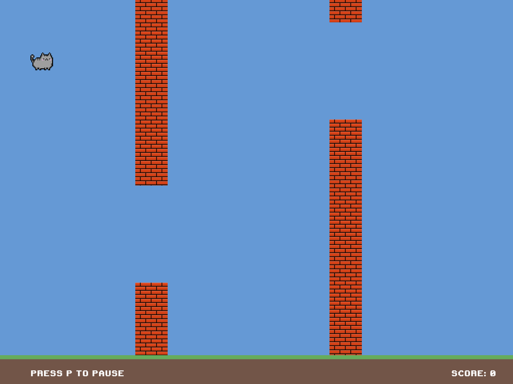
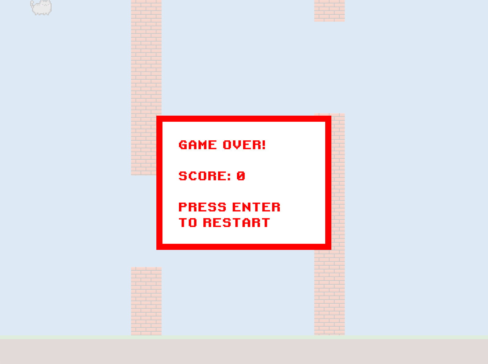
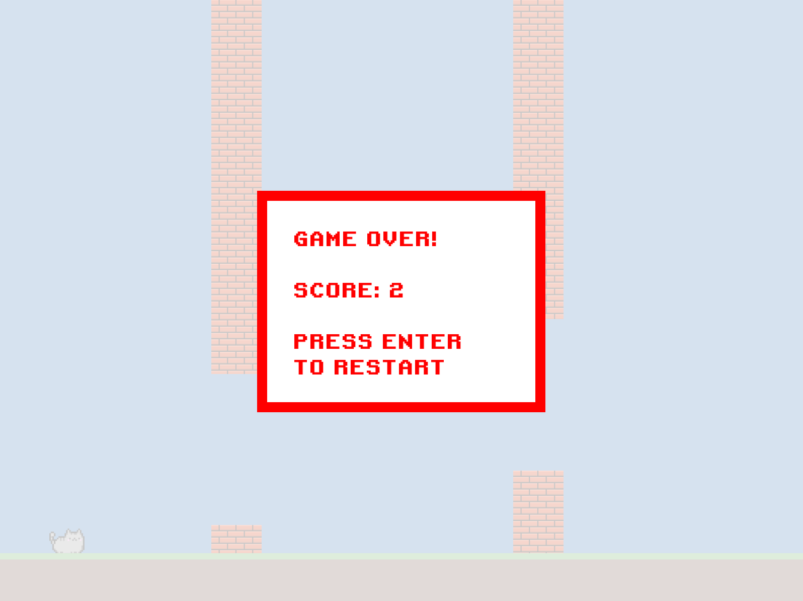
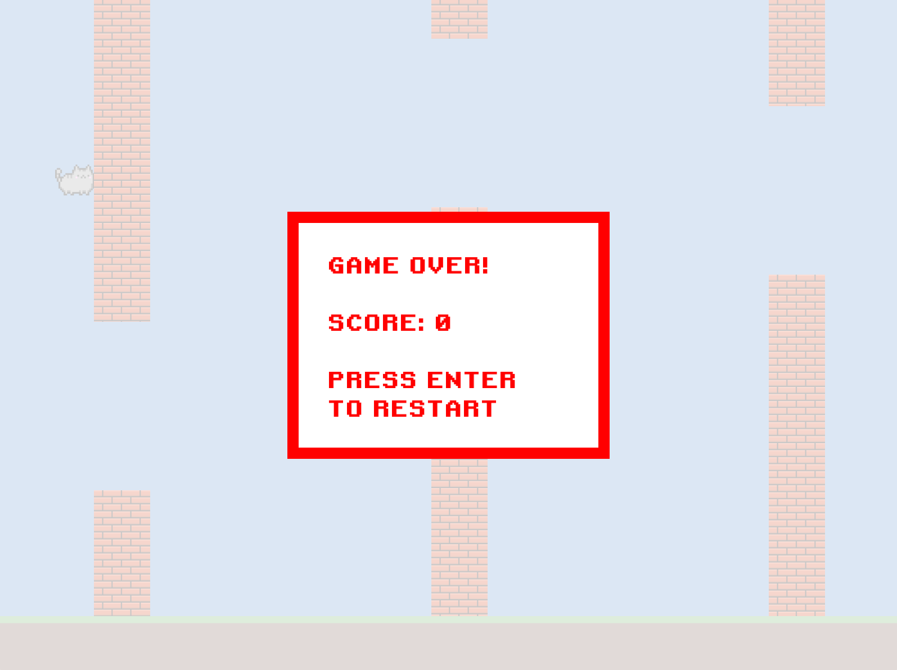

# Flappy Circle

1. How to play

The gameplay is simple – it's similar to the once popular mobile game Flappy Bird. But there is no bird in this game – you would have to guide a cat through the obstacles instead.

* If no key is pressed, the cat just drops to the ground
* To make the cat jump, press Space 
* The rule of three in our game:
  * Don't hit the ceiling! 
  * Don't hit the grass! 
  * Last and probably the hardest, don't hit the wall! 
